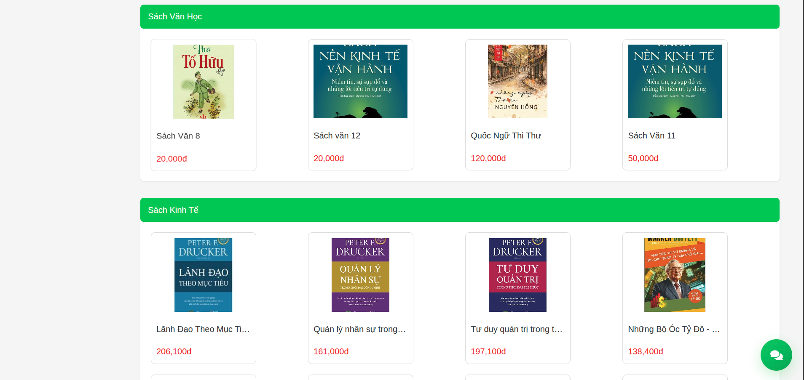
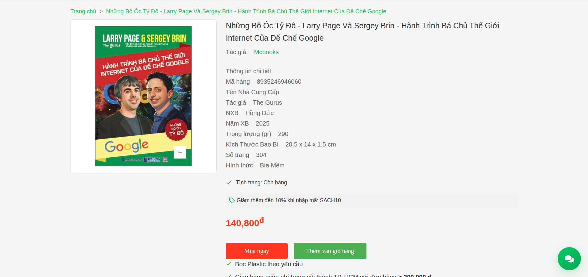
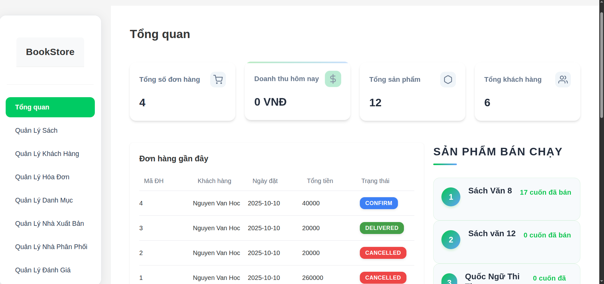
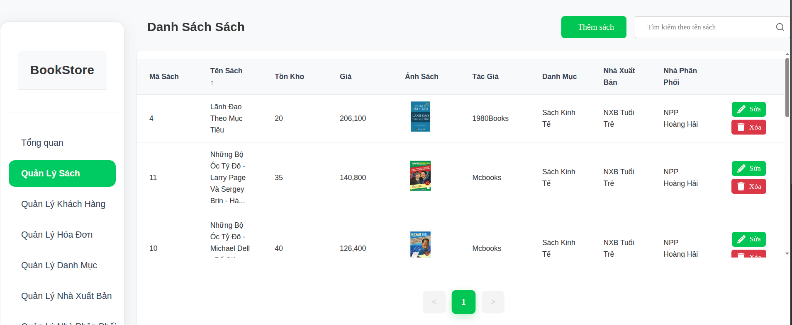

# BookStore

## Introduction
BookStore là một nền tảng bán sách trực tuyến hiện đại được phát triển theo mô hình Full-Stack Web Application.
Hệ thống cho phép người dùng dễ dàng tìm kiếm, xem thông tin, mua sách trực tuyến và thanh toán an toàn.
Được thiết kế với giao diện thân thiện và hiệu năng cao, BookStore hướng tới mục tiêu mang lại trải nghiệm đọc và mua sắm tốt nhất cho người dùng.

## Demo











BookManager
## Technology Stack

### Backend
- Spring Boot 3 (Java 17)
- Maven
- Spring Security (JWT)
- Spring Data JPA (MySQL)
- MapStruct, Lombok
- Mail + Thymeleaf Template
- Cloudinary integration
- VNPay integration
- Gemini integration

### Frontend
- ReactJS (Create React App)
- React Router
- MUI (Material UI)
- Chart.js

### Database
- MySQL 8

### Authentication
- JWT

### External
- VNPay
- Gemini

## Project Structure
```
├── bookstore-backend/
│   ├── src/
│   │   ├── main/java/com/bookstore/backend/
│   │   │   ├── controller/      # REST controllers (Auth, Book, Cart, ...)
│   │   │   ├── service/         # Services và impl/* (Payment, Gemini, ...)
│   │   │   ├── repository/      # Spring Data JPA repositories
│   │   │   ├── model/           # Entities
│   │   │   ├── dto/             # DTO, request/response
│   │   │   ├── mapper/          # MapStruct mappers
│   │   │   └── configuration/   # Security, Cloudinary, VNPay, Gemini, WebConfig
│   │   └── main/resources/
│   │       ├── application.yml
│   │       └── application.properties
│   └── pom.xml
│
└── FE/
    ├── src/                      # pages/, components/, assets/...
    ├── public/
    └── package.json
```

## Contributing
1. Fork repository
2. Tạo nhánh tính năng (`git checkout -b feature/AmazingFeature`)
3. Commit thay đổi (`git commit -m 'Add some AmazingFeature'`)
4. Push nhánh (`git push origin feature/AmazingFeature`)
5. Mở Pull Request

