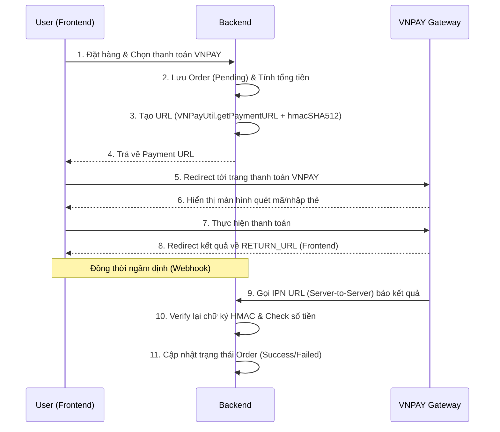
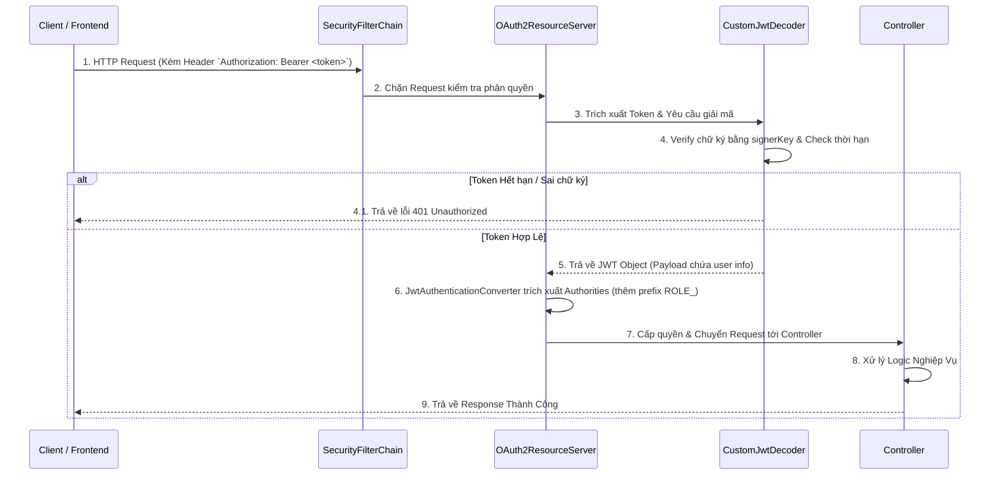

# Tổng Hợp Kiến Thức Kỹ Thuật: Dự Án Bookstore Backend

Tài liệu này tổng hợp chi tiết các công nghệ được sử dụng trong dự án `bookstore-backend`. Đặc biệt, tài liệu sẽ đi sâu phân tích hai thành phần quan trọng thường được hỏi trong các buổi phỏng vấn: **Cơ chế Bảo mật (Spring Security)** và **Tích hợp cổng thanh toán (VNPAY)**.

---

## 1. Nền Tảng Công Nghệ Cốt Lõi (Core Tech Stack)
* **Ngôn ngữ:** Java 17.
* **Framework:** Spring Boot 3.4.4.
* **Database & ORM:** MySQL 8.0, Spring Data JPA (Hibernate).
* **Tiện ích:** Lombok (giảm boilerplate code), MapStruct (ánh xạ DTO và Entity).
* **Dịch vụ Đám mây & Bên thứ 3:** Cloudinary (lưu trữ ảnh), AWS S3, Gmail SMTP (gửi email với Thymeleaf), Google Gemini AI.

---

## 2. Chi Tiết Tích Hợp Thanh Toán VNPAY

Tích hợp cổng thanh toán là một chức năng thực tế và phức tạp. Trong dự án này, luồng thanh toán VNPAY được thực hiện chuẩn chỉ theo tài liệu của VNPAY.

### 2.1. Cấu Hình (Configuration)
Thông kết nối VNPAY được tách bạch trong file `.env` và nạp vào `application.yml` nhằm đảm bảo tính bảo mật, không hardcode mã bí mật vào source code:
* `PAY_URL`: URL API của VNPAY (môi trường sandbox).
* `TMN_CODE`: Mã website đăng ký với VNPAY.
* `SECRET_KEY`: Chuỗi bí mật dùng để tạo chữ ký điện tử (hash), đảm bảo tính toàn vẹn dữ liệu.
* `RETURN_URL`: Đường dẫn (của Frontend `http://localhost:3000/...`) để VNPAY redirect về sau khi khách hàng thanh toán xong.

### 2.2. Chi Tiết Triển Khai Trong Mã Nguồn
* **Lớp tiện ích `VNPayUtil`**: 
  * Hàm `hmacSHA512()`: Nhiệm vụ tối quan trọng. Hàm này dùng `SECRET_KEY` để băm (hash) toàn bộ tham số gửi đi (hoặc nhận về) bằng thuật toán **HmacSHA512**. Chữ ký này giúp VNPAY biết request thực sự đến từ hệ thống của bạn và chưa bị giả mạo trên đường truyền.
  * Hàm `getIpAddress()`: Lấy IP của người dùng thực hiện giao dịch (bắt buộc bởi VNPAY để phục vụ tracking & chống gian lận).
  * Hàm `getPaymentURL()`: Tạo chuỗi Query String chuẩn hóa các tham số (sắp xếp theo alphabet) trước khi băm chữ ký.
* **Tạo đơn hàng & Chuyển hướng (`OrderController.createOrderWithPayment`)**: 
  * Khi người dùng chọn thanh toán VNPAY, hệ thống sẽ lưu đơn hàng vào DB với trạng thái "Pending" (chưa thanh toán).
  * Backend gọi service tính toán tổng tiền, ghép nối với `VNPayUtil` tạo ra chuỗi URL thanh toán, và trả về URL này trong response `OrderPaymentResponse` cho Frontend. Frontend sẽ tự động redirect trình duyệt của người dùng sang trang thanh toán của VNPAY.

### 2.3. Sơ Đồ Luồng Xử Lý VNPAY (Payment Flow)

---

## 3. Chi Tiết Triển Khai Spring Security & JWT

Dự án áp dụng kiến trúc **Stateless Authentication (Xác thực phi trạng thái)** rất hiện đại bằng **JWT (JSON Web Token)** thông qua module **OAuth2 Resource Server** của Spring Security.

### 3.1. Phân Quyền (Role-Based Access Control)
Trong `SecurityConfig.java`, dự án thiết lập `SecurityFilterChain` với các phân tầng quyền hạn rõ ràng:
* **Public Endpoints**: Các API cho phép truy cập tự do không cần đăng nhập (được cấu hình qua mảng `PUBLIC_ENDPOINTS` hoặc request HTTP `POST`, `GET` có tiền tố `/api/**`).
* **Admin Endpoints (`/admin/**`)**: Bắt buộc người dùng phải có quyền `ROLE_ADMIN` (sử dụng method `.hasRole("ADMIN")`).
* **User Endpoints (`/users/**`)**: Yêu cầu người dùng phải có quyền `ROLE_USER` hoặc `ROLE_ADMIN`.
* Bật cấu hình **CORS** toàn cục cho phép `http://localhost:3000` truy cập API, truyền nhận Headers và Token/Cookie.
* Tắt **CSRF (Cross-Site Request Forgery)** (`httpSecurity.csrf(AbstractHttpConfigurer::disable)`) vì hệ thống dùng JWT Stateless (không dùng Session lưu trên Server nên không sợ lỗi bảo mật CSRF truyền thống).

### 3.2. Quá Trình Xử Lý JWT (Authentication Flow)
Kiến trúc xác thực khác biệt một chút so với cách thủ công tạo filter `OncePerRequestFilter`, mà sử dụng chuẩn `oauth2ResourceServer`:

1. **Nhận Token**: Client gửi request đính kèm header `Authorization: Bearer <token>`. Spring OAuth2 Resource Server sẽ tự động bóc tách token này ra.
2. **Decode và Verify (`CustomJwtDecoder`)**:
   * Token được chuyển cho class `CustomJwtDecoder` (implement `JwtDecoder`).
   * Class này dùng thuật toán MAC (`HmacSHA512` kết hợp Nimbus JWT) cùng với `signerKey` lấy từ cấu hình để xác thực token có bị giả mạo hay đã hết hạn chưa.
3. **Chuyển Đổi Quyền Hạn (`JwtAuthenticationConverter`)**:
   * Nếu Token hợp lệ, Spring Security sẽ trích xuất danh sách các quyền (authorities/roles) từ payload của JWT.
   * `JwtGrantedAuthoritiesConverter` được cấu hình để thêm tiền tố `ROLE_` vào tên các quyền được cấp phát (vd: từ `ADMIN` thành `ROLE_ADMIN`) để đồng bộ với cơ sở xác thực Role của Spring Boot.
4. **Mã Hóa Mật Khẩu**: Sử dụng `BCryptPasswordEncoder` (độ dài vòng lặp băm là 10) thông qua Bean `passwordEncoder` để luôn mã hóa mật khẩu trước khi lưu xuống Database.

### 3.3. Sơ Đồ Luồng Xác Thực (Authentication Flow)

> [!TIP]
> **Điểm ăn tiền khi phỏng vấn**: Hãy nhấn mạnh vào việc bạn sử dụng cơ chế **OAuth2 Resource Server** có sẵn của Spring Security (thay vì viết code giải mã tay 100% bằng thư viện `jjwt`) kết hợp cùng Nimbus JWT. Nó chứng minh bạn biết cập nhật các pattern mới nhất của hệ sinh thái Spring Boot 3.x. Mọi thứ được config qua `oauth2ResourceServer(oauth2 -> ...)` rất gọn gàng.
